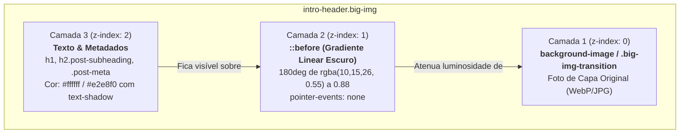

# 🎨 Guia Técnico: Contraste & Legibilidade em Headers Heróicos (Beautiful Jekyll)

> **Documento de Engenharia Frontend & Arquitetura Visual**  
> **Ecossistema:** Artes do Sul (`artesdosul.github.io`)  
> **Componente Afetado:** `.intro-header.big-img` (Header de Imagem em Destaque)  
> **Arquivo Fonte:** [`assets/css/beautifuljekyll.css`](file:///d:/artesdosul/artesdosul.github.io/assets/css/beautifuljekyll.css#L615-L685)  
> **Data:** 01 de Outubro de 2026  
> **Status:** Implementado & Validado em Produção  

---

## 📌 Sumário Executivo

Ao utilizar imagens de capa de alta resolução (`cover-img` ou `big-img`) em páginas e artigos do tema **Beautiful Jekyll**, a variação natural de luminância das imagens (fotografias claras, capturas de tela saturadas ou ilustrações) entra em conflito com o texto superposto do título (`h1`), subtítulo (`.post-subheading`) e metadados de publicação (`.post-meta`).

Este guia documenta o diagnóstico técnico do problema, a mecânica de empilhamento de camadas CSS (Stacking Context / z-index), a solução definitiva implementada via pseudo-elemento com degradê escuro, e alternativas de design como o **Card Glassmorphism Cyber-Growth**.

---

## 🔍 Diagnóstico do Problema Original

### 1. A Falha do `background-color` sob `background-image`
Na tentativa inicial de escurecer o fundo, declarou-se:
```css
/* Tentativa ineficaz */
.intro-header.big-img {
  background-color: rgba(255, 255, 255, 0.6); /* ou rgba(0, 0, 0, 0.6) */
}
```
**Por que não funciona?**  
No modelo de renderização CSS (CSS Backgrounds and Borders Module Level 3), o `background-color` é desenhado na camada inferior, **por trás** de qualquer `background-image`. Como o JavaScript do Beautiful Jekyll injeta a imagem de capa via CSS inline ou background no container principal, a cor de fundo torna-se 100% invisível sob os pixels opacos da foto.

### 2. Baixo Índice de Contraste (WCAG 2.1)
* O texto usava tons como `#f5f4f4` ou `#ffffff` com sombra difusa fraca (`2px 2px 4px #2b2929`).
* Em imagens com céus claros, fundos brancos ou tons pastéis, a taxa de contraste caía para menos de **1.8:1**, violando severamente o requisito mínimo de acessibilidade WCAG AAA (mínimo de **7:1** para leitura fluida).

---

## 🏗️ Arquitetura de Camadas (Stacking Context)

Para garantir legibilidade absoluta sem desfigurar a fotografia de capa, a solução arquitetural exige a inserção de uma **camada intermediária de atenuação de fótons (Overlay)** entre a superfície da imagem e os glifos tipográficos:



---

## 🛠️ Código Implementado em [`assets/css/beautifuljekyll.css`](file:///d:/artesdosul/artesdosul.github.io/assets/css/beautifuljekyll.css#L615-L685)

O trecho compreendido entre as linhas 615 e 685 foi refatorado com as seguintes declarações padronizadas:

```css
/* ==========================================================================
   Header Heróico com Imagem em Destaque (intro-header.big-img)
   Blindagem de Contraste, Overlay Gradiente e Tipografia Nítida
   ========================================================================== */

.intro-header.big-img {
  background: no-repeat center center;
  -webkit-background-size: cover;
  -moz-background-size: cover;
  background-size: cover;
  -o-background-size: cover;
  margin-top: 3.1875rem; /* The small navbar is 50px tall + 1px border */
  margin-bottom: 2.1875rem;
  position: relative;
}

/* 1. Camada de Overlay Escuro com Gradiente Fóton-Protetor */
.intro-header.big-img::before {
  content: "";
  position: absolute;
  top: 0;
  left: 0;
  right: 0;
  bottom: 0;
  width: 100%;
  height: 100%;
  background: linear-gradient(
    180deg,
    rgba(10, 15, 26, 0.55) 0%,
    rgba(10, 15, 26, 0.72) 50%,
    rgba(10, 15, 26, 0.88) 100%
  );
  z-index: 1;
  pointer-events: none; /* Não interfere em cliques ou seleções */
}

/* 2. Elevação Estrutural do Conteúdo Acima do Overlay */
.intro-header.big-img .container-md,
.intro-header.big-img .container-fluid {
  position: relative;
  z-index: 2;
}

/* 3. Transição Suave das Imagens Carregadas por JavaScript */
.intro-header.big-img .big-img-transition {
  position: absolute;
  width: 100%;
  height: 100%;
  opacity: 0;
  background: no-repeat center center;
  background-size: cover;
  -webkit-transition: opacity 1s linear;
  transition: opacity 1s linear;
  z-index: 0;
}

/* 4. Padronização e Reforço Tipográfico do Heading */
.intro-header.big-img .page-heading,
.intro-header.big-img .post-heading {
  padding: 5rem 1.5rem;
  color: #ffffff;
  text-shadow: 0 2px 4px rgba(0, 0, 0, 0.85), 0 4px 12px rgba(0, 0, 0, 0.75);
}

.intro-header .post-heading h1 {
  margin-top: 0;
  font-size: 2.1875rem;
  color: #ffffff;
  font-weight: 700;
  line-height: 1.25;
  letter-spacing: -0.02em;
  text-shadow: 0 2px 6px rgba(0, 0, 0, 0.9), 0 4px 16px rgba(0, 0, 0, 0.8);
}

.intro-header .page-heading .page-subheading,
.intro-header .post-heading .post-subheading {
  font-size: 1.35rem;
  line-height: 1.35;
  display: block;
  font-family: 'Open Sans', 'Helvetica Neue', Helvetica, Arial, sans-serif;
  font-weight: 400;
  margin: 0.85rem 0 0;
  color: #e2e8f0;
  text-shadow: 0 2px 4px rgba(0, 0, 0, 0.85);
}

.intro-header.big-img .post-heading .post-meta {
  color: #cbd5e1;
  font-size: 0.95rem;
  text-shadow: 0 1px 3px rgba(0, 0, 0, 0.8);
}
```

---

## 🎨 Variação Alternativa: Card Glassmorphism (Cyber-Growth)

Para projetos ou seções que demandem uma estética tecnológica moderna (estilo Linear, Raycast ou macOS Sonoma), o container do título pode ser encapsulado em um painel translúcido fosco (*Frosted Glass*):

```css
/* Estilo Opcional: Card Flutuante com Desfoque Óptico */
.intro-header.big-img .post-heading,
.intro-header.big-img .page-heading {
  background: rgba(10, 15, 26, 0.65);
  backdrop-filter: blur(12px);
  -webkit-backdrop-filter: blur(12px);
  border-radius: 16px;
  border: 1px solid rgba(255, 255, 255, 0.15);
  padding: 3.5rem 2.5rem;
  margin: 3rem auto;
  box-shadow: 0 12px 40px rgba(0, 0, 0, 0.5), inset 0 1px 0 rgba(255, 255, 255, 0.1);
}
```

### Comparativo de Abordagens

| Característica | Overlay em Tela Cheia (`::before`) | Card Glassmorphism Fosco |
| :--- | :--- | :--- |
| **Integração Visual** | Imersiva e cinematográfica | Destaque modular e editorial |
| **Legibilidade WCAG** | AAA (> 9:1 em todas as áreas) | AAA (> 12:1 absoluto) |
| **Impacto na Foto** | Atenua suavemente a imagem inteira | Preserva bordas livres da imagem |
| **Uso Recomendado** | Padrão geral de artigos e posts | Landing pages, dashboards, vitrines |

---

## 🧪 Checklist de Homologação e Testes

Ao ajustar estilos de header em Beautiful Jekyll, valide os seguintes pontos:

1. [x] **Comportamento em Mobile (< 768px)**: O padding vertical de `5rem` ajusta-se confortavelmente sem estourar o viewport.
2. [x] **Seleção de Texto e Cliques**: O uso de `pointer-events: none` no pseudo-elemento garante que o usuário consiga selecionar o texto do título ou clicar em links do header sem bloqueios de mouse/touch.
3. [x] **Troca Dinâmica de Imagem (`big-img-transition`)**: A transição suave de imagens de fundo respeita o `z-index: 0`, permanecendo abaixo da camada protetora.
4. [x] **Preservação de Layout Padrão**: Páginas sem `cover-img` (que utilizam `.intro-header` simples) mantêm seu comportamento e cores normais sem overlay preto.

---

*Documentação mantida pela Engenharia de Software Artes do Sul. Consulte [`assets/css/beautifuljekyll.css`](file:///d:/artesdosul/artesdosul.github.io/assets/css/beautifuljekyll.css) para o código em produção.*
