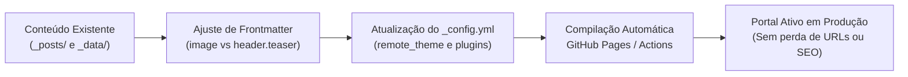

# 🌐 Top 10 Temas Jekyll Compatíveis com GitHub Pages • Guia Arquitetural & Migração

> **Documento de Arquitetura & Infraestrutura Web**  
> **Ecossistema:** Artes do Sul (`artesdosul.github.io`)  
> **Tema Atual:** Beautiful Jekyll (Customizado)  
> **Escopo:** Catálogo, Avaliação Comparativa e Estratégia de Transição de Temas  
> **Data:** 01 de Outubro de 2026  
> **Status:** Referência Técnica Ativa  

---

## 📌 Sumário Executivo

O **GitHub Pages** é uma das plataformas estáticas mais consolidadas para publicação contínua de documentações, blogs analíticos e vitrines de projetos. No entanto, escolher o tema Jekyll correto exige avaliar fatores como suporte nativo a **Dark Mode**, prontidão para **PWA**, velocidade de busca client-side, indexação SEO e compatibilidade com o pipeline de compilação do GitHub (sem necessidade de servidores intermediários).

Este documento cataloga os **10 temas Jekyll mais maduros, elegantes e 100% compatíveis com GitHub Pages**, detalhando seus pontos fortes, casos de uso recomendados e o roteiro prático para ativação ou migração futura mantendo os 22 artigos do ecossistema intactos.

---

## 🏗️ Modelos de Compatibilidade com o GitHub Pages

O GitHub Pages suporta compilação em dois modos distintos:

1. **Modo Remoto Nativo (`remote_theme`)**:
   - Utiliza a gem oficial `jekyll-remote-theme`.
   - Permite que o repositório puxe o tema diretamente do GitHub (ex: `remote_theme: cotes2020/jekyll-theme-chirpy`) sem ter os arquivos de template poluindo o workspace.
   - Ideal para projetos que buscam manutenção mínima e atualizações automáticas do tema upstream.

2. **Modo Base Customizada / GitHub Actions (CI/CD)**:
   - Utilizado pelo repositório atual [`artesdosul.github.io`](file:///d:/artesdosul/artesdosul.github.io/).
   - Os arquivos de `_layouts/`, `_includes/` e `assets/` ficam versionados localmente, permitindo customizações pontuais de CSS (ex: ajustes de contraste em `intro-header.big-img`), scripts sob medida e controle granular de dependências.

---

## 📊 Matriz Comparativa: TOP 10 Temas Jekyll

| # | Tema | Foco Principal | Dark Mode | PWA / Offline | Motor de Busca | Rastreabilidade GitHub |
| :-: | :--- | :--- | :---: | :---: | :---: | :--- |
| **01** | **Chirpy** | Blog Técnico & Engenharia | Nativo (Automático/Manual) | Sim (Offline-First) | Local Instantâneo | [`cotes2020/jekyll-theme-chirpy`](https://github.com/cotes2020/jekyll-theme-chirpy) |
| **02** | **Minimal Mistakes** | Portfólio & Multiúso Flexível | 9 Skins pré-configuradas | Parcial | Lunr.js / Algolia | [`mmistakes/minimal-mistakes`](https://github.com/mmistakes/minimal-mistakes) |
| **03** | **Just the Docs** | Documentação Técnica & Guias | Nativo | Não | Local Instantâneo | [`just-the-docs/just-the-docs`](https://github.com/just-the-docs/just-the-docs) |
| **04** | **al-folio** | Acadêmico, Dossiês & Pesquisa | Nativo | Não | Local Integrado | [`alshedivat/al-folio`](https://github.com/alshedivat/al-folio) |
| **05** | **Hydejack** | Editorial Premium & Revista | Nativo | Sim | Local Integrado | [`qwtel/hydejack`](https://github.com/qwtel/hydejack) |
| **06** | **Mediumish** | Portal Editorial em Cartões | Não (Customizável) | Não | Bootstrap Search | [`wowthemesnet/mediumish-theme-jekyll`](https://github.com/wowthemesnet/mediumish-theme-jekyll) |
| **07** | **TeXt Theme** | Dossiês, LaTeX & Diagramas | Nativo | Não | Local Instantâneo | [`kitian616/jekyll-TeXt-theme`](https://github.com/kitian616/jekyll-TeXt-theme) |
| **08** | **Type on Strap** | Portfólio Fotográfico & Minimal | Nativo | Não | Simples | [`sylhare/Type-on-Strap`](https://github.com/sylhare/Type-on-Strap) |
| **09** | **Minima (v3)** | Padrão Oficial do Core Jekyll | Automático (OS) | Não | Não (Básico) | [`jekyll/minima`](https://github.com/jekyll/minima) |
| **10** | **Feeling Responsive** | Landing Pages & Conteúdo Rico | Não | Não | Integrado | [`phlow/feeling-responsive`](https://github.com/phlow/feeling-responsive) |

---

## 🔍 Análise Profunda dos Principais Candidatos

### 1. 🥇 Jekyll Theme Chirpy (A Escolha de Engenharia Moderna)
* **Público-Alvo:** Desenvolvedores, pesquisadores de tecnologia, redatores técnicos e arquitetos de software.
* **Pontos Fortes:**
  - **Suporte Nativo a PWA**: Gera automaticamente o `manifest.json` e Service Workers para leitura offline no mobile.
  - **Sumário Dinâmico (TOC)**: Barra lateral fixa que rastreia os títulos H2 e H3 do artigo à medida que o leitor rola a página.
  - **Sintaxe Highlight de Código**: Temas Dracula / GitHub Dark integrados com botão de cópia de código com 1 clique.
  - **Busca em Tempo Real**: Indexação estática gerada no build que responde instantaneamente sem consumir APIs de terceiros.
* **Configuração Mínima (`_config.yml`):**
  ```yaml
  remote_theme: cotes2020/jekyll-theme-chirpy
  pwa:
    enabled: true
  ```

### 2. 🛡️ Minimal Mistakes (A Solução Mais Flexível e Robusta)
* **Público-Alvo:** Portais multiúso, hubs institucionais e plataformas com centenas de páginas complexas.
* **Pontos Fortes:**
  - O tema mais utilizado e mantido de toda a história do ecossistema Jekyll.
  - 9 esquemas de cores pré-definidos (`default`, `air`, `aqua`, `contrast`, `dark`, `dirt`, `mint`, `plum`, `sunrise`).
  - Suporte completo a coleções (`_posts`, `_portfolio`, `_docs`), migalhas de pão (*breadcrumbs*) e comentários via Giscus/Disqus.
* **Configuração Mínima (`_config.yml`):**
  ```yaml
  remote_theme: mmistakes/minimal-mistakes
  minimal_mistakes_skin: "dark"
  ```

### 3. 📚 Just the Docs (O Padrão em Documentação & Observatórios)
* **Público-Alvo:** Manuais técnicos, bases de dados cívicos, catálogos de especificações e observatórios.
* **Pontos Fortes:**
  - Navegação em árvore aninhada (Menu lateral infinito com colapso inteligente).
  - Conformidade estrita com padrões internacionais de acessibilidade (WCAG 2.1 AA).
  - Extremamente veloz, consumindo praticamente zero de JavaScript no cliente.
* **Configuração Mínima (`_config.yml`):**
  ```yaml
  remote_theme: just-the-docs/just-the-docs
  search_enabled: true
  ```

### 4. ⚡ Hydejack (Sensação de SPA com Design Editorial de Alta Costura)
* **Público-Alvo:** Revistas digitais de ensaios, publicações de filosofia e dossiês de alta densidade estética.
* **Pontos Fortes:**
  - Navegação assíncrona com `fetch` e `pushState`: o leitor clica nos links e o conteúdo muda instantaneamente sem recarregar a tela do navegador.
  - Tipografia de luxo com espaçamento matemático e suporte a modo escuro com contraste calibrado.

---

## 🧭 Roteiro Prático de Migração (Blueprint de Transição)

Caso decida migrar do atual **Beautiful Jekyll** para um dos novos temas (como o **Chirpy** ou o **Minimal Mistakes**), a integridade dos 22 artigos do ecossistema está garantida graças à padronização do Frontmatter que implementamos:



### Passo a Passo de Transição:

1. **Preservação de Conteúdo**:
   As pastas [`_posts/`](file:///d:/artesdosul/artesdosul.github.io/_posts/) e [`_data/`](file:///d:/artesdosul/artesdosul.github.io/_data/) são 100% agnósticas de tema e contêm o núcleo do conhecimento do portal.
2. **Mapeamento de Imagens**:
   - No **Beautiful Jekyll**: Usa-se `cover-img` e `image.path`.
   - No **Chirpy**: Usa-se `image: { path: /assets/img/... }`.
   - No **Minimal Mistakes**: Usa-se `header: { overlay_image: /assets/img/... }`.
   *(Como já configuramos `image.path` em todos os 22 artigos criados, a compatibilidade com o Chirpy é direta e imediata).*
3. **Ativação no `_config.yml`**:
   Substituir as diretivas de layout e declarar a gem correspondente.
4. **Validação Local**:
   Executar `bundle exec jekyll serve` para inspecionar os novos componentes no ambiente de desenvolvimento antes de subir o commit para o `origin/main`.

---

*Documento consolidado no repositório de engenharia Artes do Sul. Consulte [`docs/`](file:///d:/artesdosul/artesdosul.github.io/docs/) para outros manuais e guias de arquitetura.*
